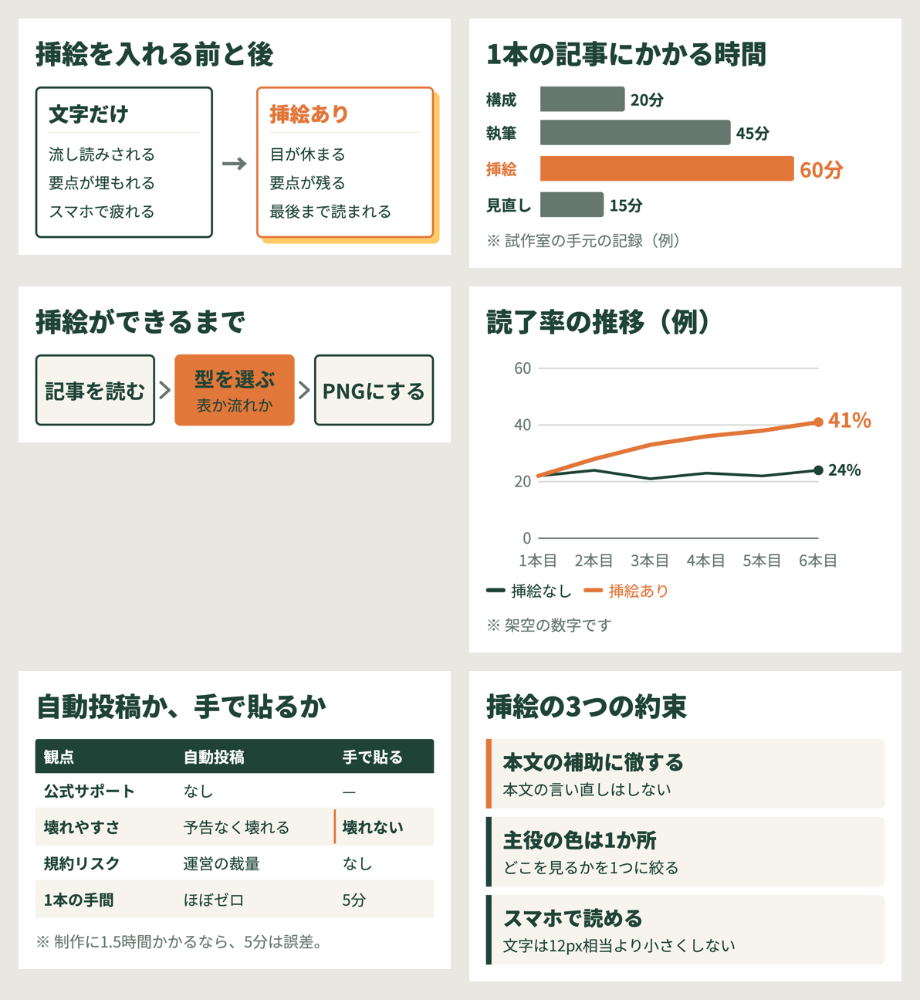

# note-fig — note の記事に、スマホで読める挿絵を

文字ばかりの記事は、スマホで読むと疲れます。
表やグラフが1枚あるだけで、目が休まり、要点が残ります。

**note-fig** は、Claude Code に記事を渡すと、挿絵を入れる場所を提案し、
**スマホで読める大きさを自動で検査したうえで** PNG を書き出す道具です。
Figma もデザインの知識も要りません。



## なぜ作ったか

note の挿絵は、スマホでは**幅 343pt まで縮みます**。PC の画面で作った図は、
スマホで見ると文字が 8px 前後になっていることがよくあります。読めません。

この一式は、note の表示幅を実測して決めた基準（最小文字・1行28字・表は3列まで・主役の色は1か所）を
**道具の側で守ります**。書き手は「どこに何を伝える図を入れるか」だけ決めれば済みます。

## できること

12の型（Organism）にデータを流し込んで描きます。

| 比べる | 順番 | 量・変化 | まとめる |
|---|---|---|---|
| 比較テーブル `table` | プロセス `flow` | 横棒 `bar` | 大きな数字 `stat` |
| 2項の対比 `compare` | 番号付き手順 `steps` | 折れ線 `line` | 要点カード `points` |
| 積層 `layers` | 時系列 `timeline` | 構成比 `share` | スクショ枠 `window` |

## はじめかた

**必要なもの**：[Claude Code](https://claude.com/claude-code)、Python 3.9 以上、Google Chrome。
pip で入れるものはありません。

### 1. プラグインとして入れる

Claude Code で次を実行します。

```
/plugin marketplace add bigtree1984/note_fig
/plugin install note-fig@bigtree-lab
```

### 2. 頼む

記事の下書き（md ファイルや note の URL）を渡して、こう頼みます。

> この記事に挿絵を入れたい

Claude Code が `PLAYBOOK.md` を読み、次の順で進めます。

1. 記事の場所・配色・置き場所を確認する
2. 図を入れる場所を表で提案する（ここで取捨選択してください）
3. 承認された図を作り、検査する
4. スマホ実寸と PC 実寸を並べた確認ページを見せる
5. 「どの PNG を、どの文の後に貼るか」を渡す

### 手で動かす場合

```bash
git clone --depth 1 https://github.com/bigtree1984/note_fig.git
cd note_fig
python3 scripts/render.py bigtree/samples --out out --preview
open out/_preview.html
```

## 自分の色にする

同梱の配色は作者（Bigtree Lab）の見本です。`bigtree/` をコピーして `tokens.css` の
7色と書体を書き換え、`NOTE_FIG_BRAND` でそのフォルダを指すと、自分のブランドで描けます。
手順は [PLAYBOOK.md §2](PLAYBOOK.md#2-自分のブランドに差し替える)。

**見た目をそのまま真似しないでください。** 価値があるのは配色ではなく、
「スマホで読める」を自動で守る仕組みのほうです。

## 中身

| | |
|---|---|
| [PLAYBOOK.md](PLAYBOOK.md) | エージェントが最初に読む手順書。守ること（【変えない】）と聞くこと（【先に聞く】） |
| [docs/CATALOG.md](docs/CATALOG.md) | 型の選び方と JSON の書き方 |
| [docs/FIGURE_RULES.md](docs/FIGURE_RULES.md) | 数値の根拠（note の表示幅の実測など） |
| `engine/` | 描画エンジン（HTML/CSS/JS）。`note.css` が note の制約、`organisms.js` が型と検査 |
| `bigtree/` | 見本のブランド。`tokens.css` と見本の JSON |
| `scripts/render.py` | JSON → PNG と検査、確認ページ |
| `skills/note-fig/` | Claude Code のスキル |

## できないこと

- 見出し画像（ヘッダー）。記事の顔は書き手ごとのスタイルなので、対象外にしています
- ベン図や曲線の矢印など、手で位置を決める図
- スクショの中の文字を大きくすること

## ライセンス

MIT。`bigtree/` の配色と見本の文章も、見本として同じ MIT で公開しています。
書体（Noto Sans JP、SIL Open Font License）は同梱せず、Google Fonts から読み込みます。
